# Music Emotion Classification

Project for CS7641 Machine learning

### Midterm Report

  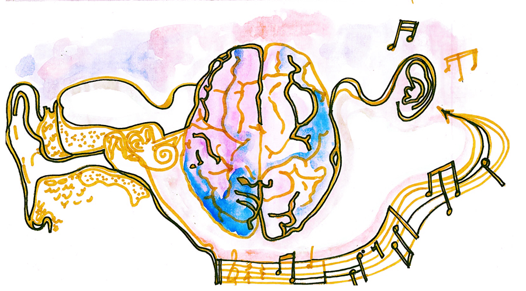

### Introduction

Music recommendation systems have become popular over the years, helping users discover new music that aligns with their preferences. However, it can be challenging to establish a connection between the user's data and music listening history[1]. Traditional music recommendation systems often rely on factors such as genre or artist, which may not accurately reflect the user's emotional state or mood. Music emotion recognition (MER) has drawn attention from academia to industry and can be applied to music recommendation. MER is a method of using technology to analyze and classify the emotional content of music. In this project, we aim to enhance the identification and recognition of emotional content in music using machine learning methods.

### Background

The emotional content of music can be analyzed through various musical features, such as rhythm, melody, harmony, tempo, and dynamics, to determine the emotional state of the music. In recent years, research on MER has shown promise in accurately classifying the emotional content of music.

### Problem Definition

The main problem with traditional music recommendation systems is that they do not accurately capture the user's emotional state or mood. Our goal is to help music recommendation system suggest songs by analyzing the types of emotions in a user's favorite playlist using MER. In order to define emotions, we use The circumplex model of emotion by Russell [2], which proposes that all affective states arise from two fundamental neurophysiological systems, one related to valence (a pleasure–displeasure continuum) and the other to arousal, or alertness.

    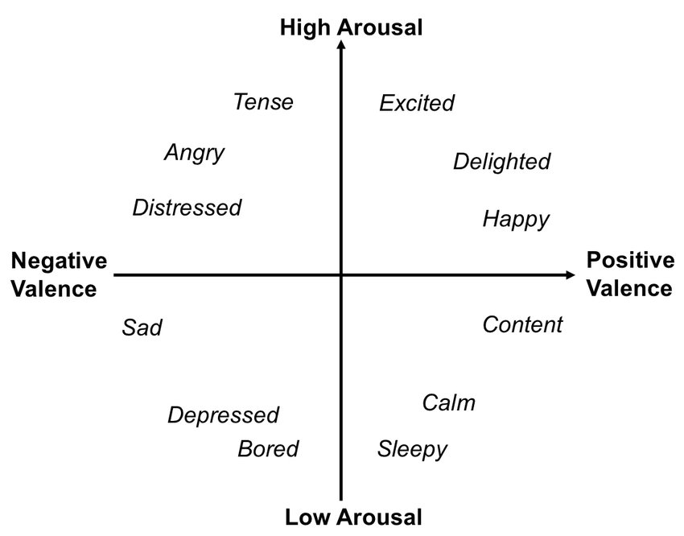

### Methods

We follow the MER framework, which involves four main points: dataset, feature extraction, models, and evaluation. For the dataset, currently we use the [DEAM](https://www.kaggle.com/datasets/imsparsh/deam-mediaeval-dataset-emotional-analysis-in-music) dataset [3], which contains audio and physiological signals recorded from participants while they listened to music. The DEAM dataset provides a set of features that have already been extracted using openSMILE1. The features are in CSV format, with the first value in each row being a timestamp, and the rest of the values being the features extracted from the 500ms window at that timestamp. For models, we use various machine learning methods for music emotion classification on the DEAM dataset, including supervised learning methods: KNN, random forest, linear regression, and unsupervised learning methods: GMM, PCA and K-means. Our model predicts arousal and valence based on song level, which is a regression problem. We convert the predicted arousal and valence values to the 4 main emotions (4 quadrants in circumplex model of emotion) and 12 subemotions. Then it becomes a classification problem. We use several evaluation metrics, such as R2 (for regression), F1-score and accuracy (for classification), to evaluate the performance of our models for both the main emotions and subemotions in supervised learning. We also use Silhouette Coefficient to evaluate unsupervised learning models.

### Results and Discussion

In order to prepare the data for the model, the following pre-processing techniques were employed:

#### Feature Selection

We use all 260 features and also explore PCA to reduce the dimensionality of the features. The selected principal components are used as the input features for all the models.

#### Data Normalization

StandardScaler was used to normalize the data.

#### Data Split

We split the data into training and test sets using train_test_split() from sklearn.model_selection module. the 80% will be used for training, while the remaining 20% of the data will be used for testing.

#### Model Development and Results

#### Supervised Learning

##### 1.Linear Regression

Linear regression was used to predict the emotional valence and arousal of music. The results obtained are as follows:

  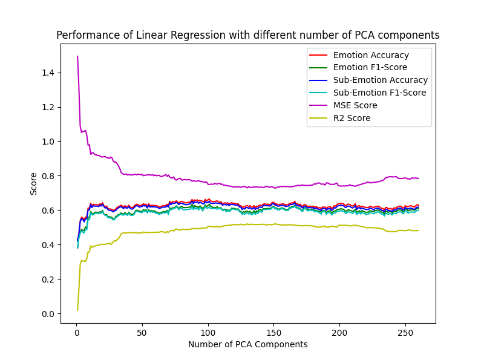

The results show that the model was able to predict the emotional valence and arousal of music with moderate accuracy. However, there is still room for improvement as the R2 score is not very high.

##### 2. Random Forest

To explore the performance of Random Forest, we use n_estimators_range = [10, 50, 100, 250, 500, 750] to test different values of the number of trees in the forest. We also use PCA to reduce the dimensionality of the input data. The model we apply PCA to is with 100 estimators. The results for performance vs the number of estimators and PCA K features are as follows:

  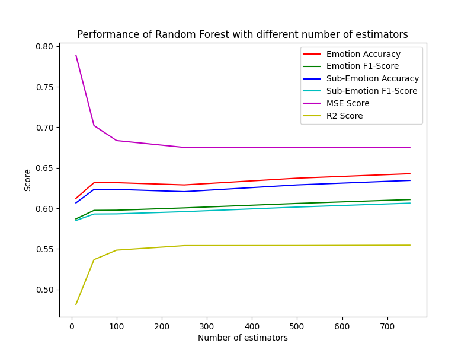
  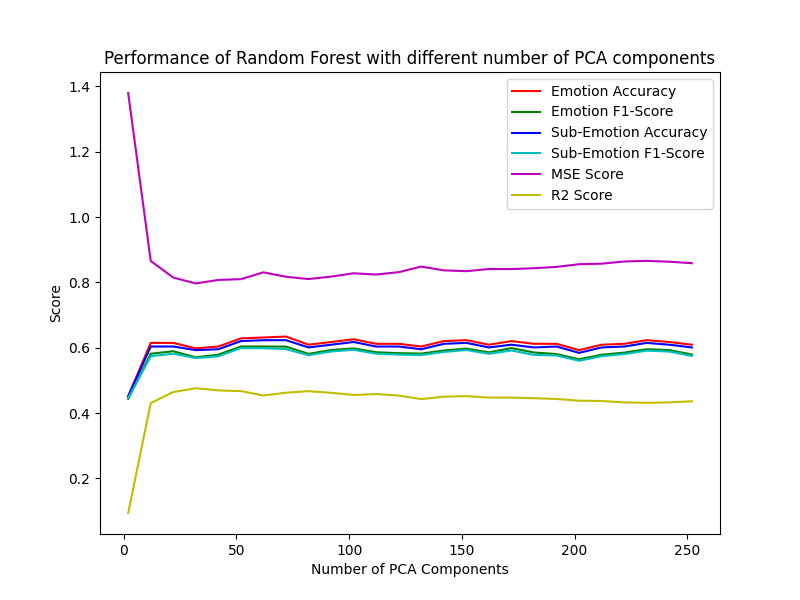

The results show that increasing the number of estimators generally leads to higher performance scores. However, we observed that the performance gain from increasing the number of estimators is more significant when the number of estimators is below 100, and the performance improvement becomes less noticeable beyond 100 estimators. This suggests that increasing the number of estimators can be an effective way to improve the performance of Random Forest, but the improvement becomes less significant as the number of estimators increases beyond a certain point. Moreover, we found that the performance of the model is relatively stable when the number of PCA features is greater than 40. Beyond this point, increasing the number of PCA features does not lead to a significant improvement in performance. This suggests that there is an optimal range of PCA features that can be used to achieve good performance in music emotion classification with Random Forest.

##### 3. KNN

KNN (K-Nearest Neighbors) is an instance-based, supervised learning algorithm that can be used for both classification and regression tasks. Since our model needs to predict valence and arousal values, which are continuous output values, we used the KNeighborsRegressor. KNeighborsRegressor is a regression model based on the KNN algorithm and is a class in the scikit-learn library specifically designed for solving regression problems.

The KNN algorithm works by finding the K closest neighbors to a given data point and making a prediction based on the feature values of these neighbors. In regression tasks, the prediction is typically the average of the target values of the K neighbors.

Due to the large number of features in our dataset, we used PCA (Principal Component Analysis) in our experimental data preprocessing to reduce the dimensionality of the data while retaining as much variation information from the original data as possible. In addition, we also performed a reclassification of the predicted results and used F1 score, Accuracy, and other metrics for evaluation. The final results of our experiment are shown in the following figure:

  
  

##### 4. CNN

We use a simple Convolutional Neural Network (CNN) model for emotion classification, implemented using PyTorch. The model takes in 1-dimensional input data and consists of three convolutional layers followed by two fully connected layers. Each convolutional layer consists of a convolutional operation, followed by a Rectified Linear Unit (ReLU) activation function, max pooling, and dropout regularization. The fully connected layers consist of linear transformations followed by ReLU activation and dropout regularization. The final layer has two output units and is used for binary classification. We used a batch size of 32, a learning rate of 0.001, and the Adam optimizer. Additionally, we set the weight decay ratio to 0.95. The model was trained over 300 epochs.

  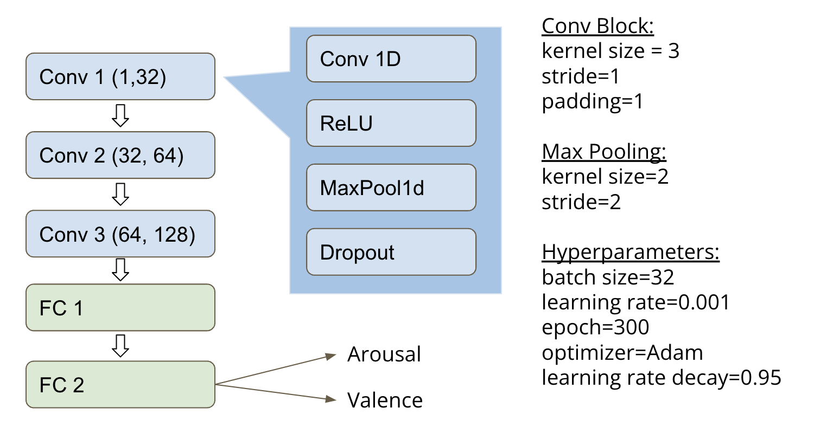

#### Unsupervised Learning

##### 1. K-means

We clustered the features of the data using Kmeans, and using PCA to reduce the dimensionality of the features. Here shows the result of elbow curve method and silhouette scores of different number of clusters and principle components.

  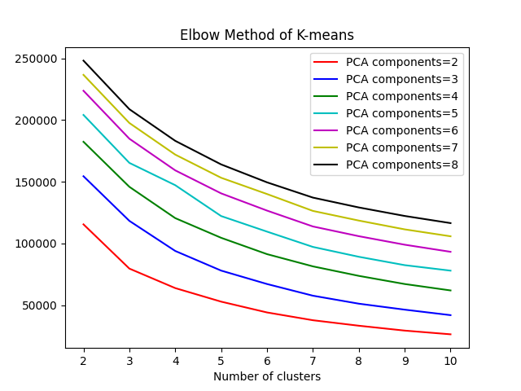
  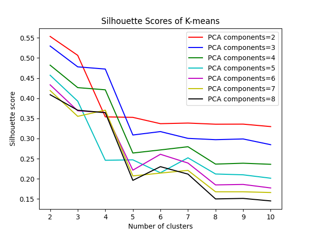

For the elbow method, it is difficult to find an obvious inflection point (probabily at 3), but we can see that the objective function value gradually stabilizes after 6 or 7 clusters. For the silhouette coefficient, the closer the silhouette coefficient is to 1, the better the clustering result. Our dataset shows that the silhouette coefficient is the largest when there are 2 clusters. The results of PCA show that the model performs best when extracting two principal components. Considering the above results, we think that the result of the two clusters is the best. The kmeans clusters plot shows as follows:

  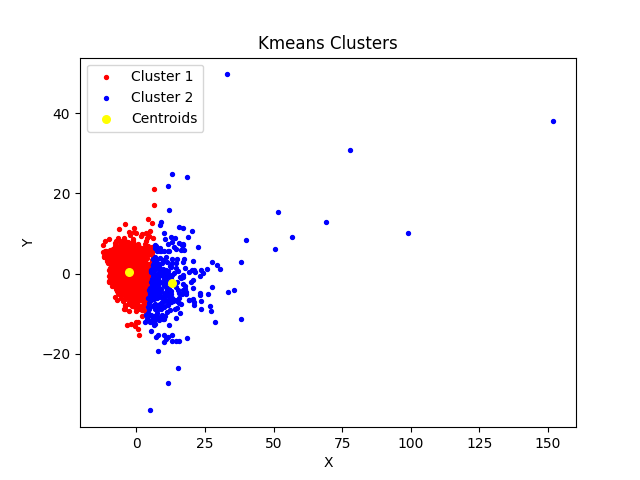

##### 2. GMM

We clustered the features of the data using GMM, and using PCA to reduce the dimensionality of the features. We also normalize the data before applying GMM. Here shows the result of accuracy rate d and silhouette scores of different number of clusters and principle components.

  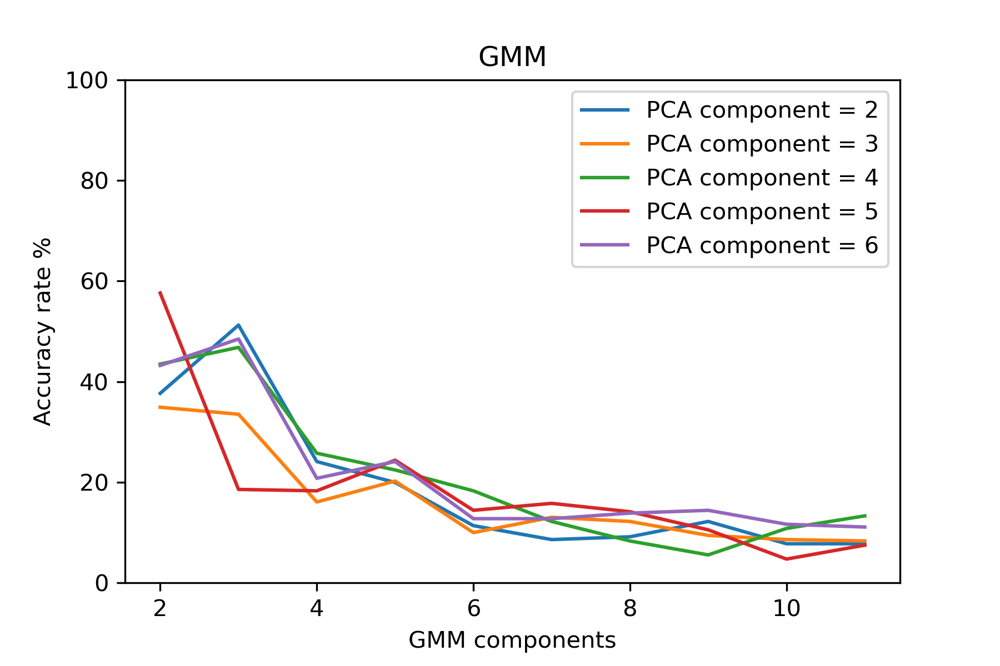
  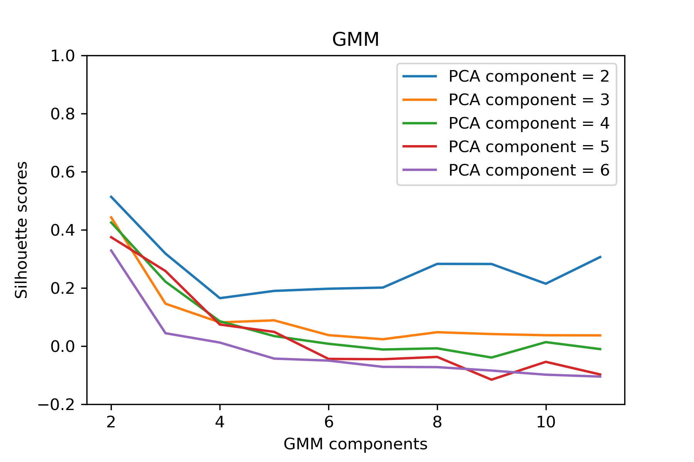

We have observed that as the number of GMM components (i.e., the cluster number) increases in our experiment results, both accuracy rate and Silhouette scores converge to small values.

Unfortunately, we have not been able to obtain satisfying results using unsupervised learning for music emotion classification, which requires quantifying valence and arousal. Based on these observations, we believe that clustering approaches may not be suitable for this task.

#### Conclusion

The best score for supervised models:

| Model | Accuracy (main) | Precision (main) | Recall (main) | F1 (main) | Accuracy (sub) | Precision (sub) | Recall (sub) | F1 (sub) | R2 |
| :-------------: | :-------------: | :-------------: | :-------------: | :-------------: | :-------------: | :-------------: | :-------------: | :-------------: | ------------- |
| Linear Regression | 0.643 | 0.6 | 0.643 | 0.617 | 0.634 | 0.594 | 0.641 | 0.613 | 0.521 |
| KNN | 0.607 | 0.576 | 0.607 | 0.585 | 0.596 | 0.566 | 0.602 | 0.577 | 0.437 |
| Random Forest | 0.604 | 0.572 | 0.604 | 0.579 | 0.593 | 0.562 | 0.599 | 0.571 | 0.47 |
| CNN | 0.62 | 0.615 | 0.583 | 0.62 | 0.594 | 0.578 | 0.622 | 0.592 | 0.498 |

In conclusion, the Linear Regression model performs the best. We tuned hyperparameters of learning rate, optimizer weight decay, and also add more layers to CNN model and changed the kernel size. However, those changes didn't significantly improve the performance. We came up with two possible reasons: The first reason is that the dataset is too small. The second reason is we only used mean arousal and valence for each audio segment. We could probably try frame-level inputs which contains more information.

## Timeline

<https://docs.google.com/spreadsheets/d/1t3r_wXtmoawwp6LNXEL4DRNVnt1sJNx-Nu9NjE3ipSY/edit#gid=1115838130>

## Contribution of each member

| Jiarui Xu | Juntao He | Shimiao Liu | Xuedan Gao | Yifeng Yu |
| :-------------: | :-------------: | :-------------: | :-------------: | ------------- |
| Set up Git repo, implement and modify linear regression model and evaluations, modify utils.py | Implement GMM | Implement KNN and plot the results| Implement kmeans and plot the results| Implement random forest, CNN, utility functions such as plot and evaluation.

## presentation
https://www.dropbox.com/s/d1k6y17605dn3tk/final_v1.mp4?dl=0

## Reference

[1] Abdul, A., Chen, J., Liao, H. Y., & Chang, S. H. (2018). An emotion-aware personalized music recommendation system using a convolutional neural networks approach. Applied Sciences, 8(7), 1103.

[2] Russell, J. A. (1980). A circumplex model of affect. Journal of personality and social psychology, 39(6), 1161.

[3] Aljanaki, A., Yang, Y. H., & Soleymani, M. (2017). Developing a benchmark for emotional analysis of music. PloS one, 12(3), e0173392.
